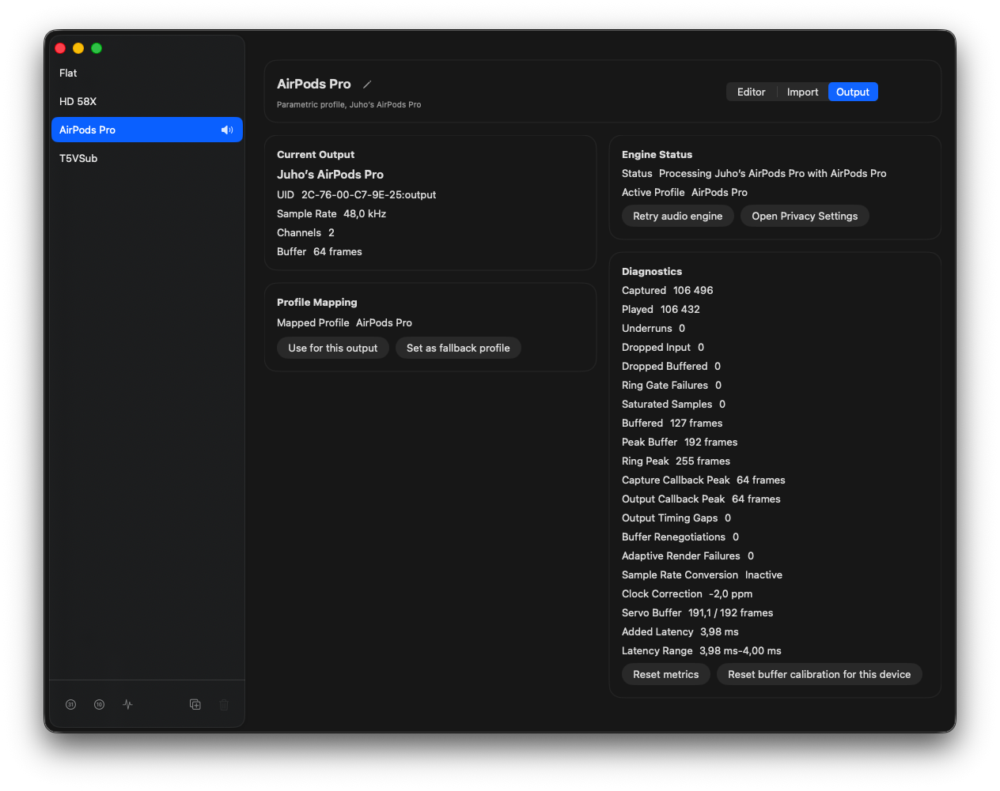
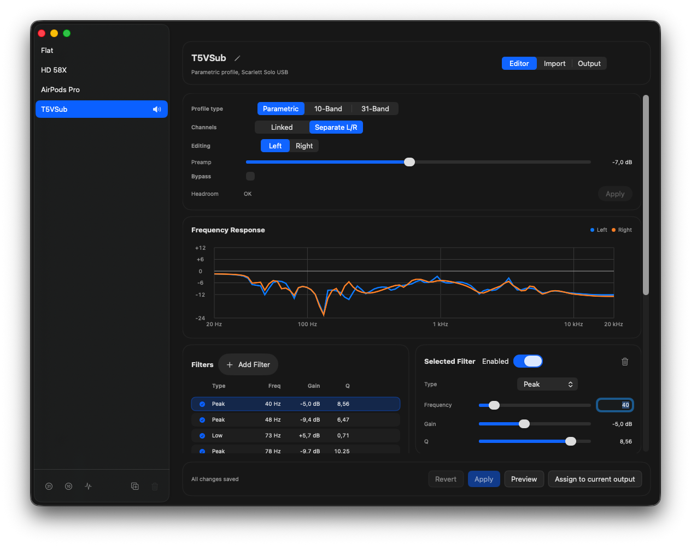

# GlassEQ alpha-0.9 Release Notes

This is a technical alpha for Apple Silicon Macs running macOS 26.

## Distribution Warning

This build is ad hoc-signed, not Developer ID signed, and not notarized. macOS Gatekeeper will reject it by default. Install only if you are comfortable testing ad hoc-signed macOS software and granting system audio capture permission.

## Changes Since alpha-0.8.1

- Playback now continuously corrects for independent capture and output clocks instead of eventually dropping or duplicating frames when nominal sample rates match but hardware clocks drift.
- GlassEQ learns a stable callback size and playback target for each output route. The Settings diagnostics show the active correction and allow the current device's calibration to be reset.
- Bidirectional Bluetooth headset modes retain their device-owned 24 or 16 kHz sample rate and use realtime sample-rate conversion with anti-alias filtering.
- Filters above a low-rate output's usable frequency ceiling are disabled in the realtime processor and identified in the editor.
- Multi-channel output devices play the stereo signal through their configured preferred stereo pair while leaving unrelated channels silent.
- Ring-buffer contention is retried within a bounded realtime budget, and capture-side dropped frames are now reported by diagnostics.
- Exact EQ values can be typed directly, and the parametric frequency control now uses a logarithmic scale.
- If the separate Settings helper cannot be launched or connected, GlassEQ opens the same Settings interface inside the menu bar process.

## How Adaptive Playback Works

GlassEQ captures system audio from a private Core Audio process tap and replays the processed stream through the physical output device. Those two sides do not necessarily share a hardware clock. Even when both report exactly 48 kHz, one clock may advance a few frames per million faster than the other. Without correction, the playback queue would slowly fill or drain until audio had to be dropped, duplicated, or allowed to underrun.

### Servo Buffer

The **Servo Buffer** diagnostic is not a second audio buffer. It shows the playback ring buffer's filtered occupancy beside the target GlassEQ is trying to maintain. For example, `191.1 / 192 frames` means the controller sees approximately 191.1 queued frames against a 192-frame target.

GlassEQ learns the callback size and target independently for each output device, output rate, tap rate, and callback-size operating point. An underrun first adds a 64-frame capture period to the target, up to three periods of extra reservoir. Further instability can move the hardware callback through a conservative 64, 128, 256, and 512-frame ladder. An operating point becomes stable after 60 seconds without another instability, and a later engine session may probe the target one 64-frame step lower. Hardware callback increases remain in place until that device's calibration is reset. Low-rate bidirectional routes use a larger fixed reservoir because their callbacks can be much larger and less regular.

### Clock Correction

**Clock Correction** is the small software rate adjustment calculated from the occupancy error. A positive value means GlassEQ consumes input slightly faster; a negative value means it consumes input slightly slower. At 48 kHz, `+40 ppm` consumes about 1.9 additional input frames per second.

GlassEQ does not change either hardware clock. It adjusts the software resampling ratio by at most ±500 ppm and limits how quickly that correction can change. This continuous correction keeps the queue centered without periodically skipping or repeating complete samples.

### Four-Point Hermite Resampling

Every route uses a four-point Hermite resampler for these tiny clock corrections. For each fractional input position it examines the sample before the position, the two samples surrounding it, and one additional sample ahead, then fits a smooth cubic curve between the middle pair. The implementation carries its fractional phase and three or four history frames across audio callbacks.

The resampler needs two already-buffered look-ahead frames, about 0.04 ms at 48 kHz. It is preallocated and runs inside the realtime callback without locking. This Hermite stage handles only the near-unity clock adjustment. When a headset route has a genuinely different nominal rate, GlassEQ follows it with Audio Toolbox's realtime-safe sample-rate converter and anti-alias filtering.

## AirPods and Teams Meetings

During normal playback, these AirPods operate at 48 kHz with 64-frame callbacks. GlassEQ keeps the queue near its 192-frame target with a −2.0 ppm correction, adding approximately 4 ms of latency without underruns or dropped frames.



When Teams activates the AirPods microphone, macOS changes the same output from its normal stereo mode to a 24 kHz bidirectional headset route with 480-frame callbacks. This is a macOS and Bluetooth route transition, not GlassEQ selecting a lower-quality mode.

GlassEQ retains the mapped profile, follows the device-owned rate, enables realtime sample-rate conversion when the tap and output rates differ, and moves to the low-rate route's conservative 2,048-frame target. The transition below registered one output timing discontinuity but no underruns, dropped frames, ring-gate failures, or adaptive render failures. The servo remained centered at `2047 / 2048 frames`.


The second screenshot retains observations from both sides of the transition, so its average latency and latency range combine normal and meeting modes. Captured and played frame counters also refer to different sample-rate domains while conversion is active and are not expected to match directly.

EQ filters above the low-rate route's usable frequency ceiling are temporarily disabled and identified in the editor. When macOS returns the AirPods to their normal-rate mode, GlassEQ removes the large-ratio converter, refreshes a low-rate capture tap if necessary, resets the clock pair, and restores full-bandwidth processing. Normal and meeting modes keep separate calibration operating points.

## Precise EQ Editing

Frequency, gain, Q, and preamp values can now be typed directly while retaining bounded sliders and live response updates. The frequency slider uses a logarithmic scale, giving low-frequency adjustments useful precision without sacrificing the full 20 Hz to 20 kHz range. Independent left and right channels keep their own exact values and response curves.



## Supported Alpha Target

- macOS 26.0 or newer.
- Apple Silicon / arm64 only.

## Known Issues

- Gatekeeper rejection is expected because the app is not notarized.
- System audio capture permission may require manual cleanup or retrying on test machines.
- Bluetooth and AirPods routes may still expose macOS Core Audio edge cases; report device model, macOS version, and steps to reproduce.
- AirPlay outputs are not yet supported.
- No automatic updates.
- No crash reporting.
- No notarized Developer ID build yet.
- No x86_64 build.

## Build Artifact

The release script writes:

```sh
.build/dist/GlassEQ-alpha-0.9-macos26-arm64.zip
.build/dist/GlassEQ-alpha-0.9-macos26-arm64.zip.sha256
```
